# 🎬 Predict A Film's Score and Revenue: A Hybrid Machine Learning Architecture

<div align="center">
  <a href="https://www.canva.com/design/your-link-here">
    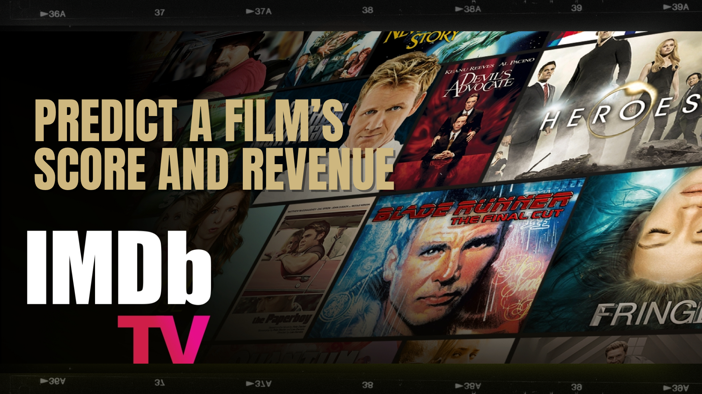
  </a>
  <p><i>Hệ thống dự báo đa nhiệm (Multi-task) ứng dụng kiến trúc học máy lai (Hybrid) cho ngành công nghiệp điện ảnh.</i></p>
</div>

<div align="center">

[](https://www.python.org/) 
[](https://streamlit.io/) 
[](https://scikit-learn.org/) 
[](https://xgboost.readthedocs.io/)

</div>

---

## 🎓 Thông Tin Đồ Án

- **Giảng viên hướng dẫn:** Thầy **Bùi Mạnh Quân**
- **Nhóm sinh viên thực hiện:** 1. **Bùi Quang Huy** 2. **Nguyễn Tài Huy** - **Đơn vị:** **Đại học Sư phạm Kỹ thuật TP.HCM (HCMUTE)** - **Chủ đề:** Dự đoán song song doanh thu phòng vé và điểm số đánh giá (IMDB), ứng dụng các kỹ thuật xử lý dữ liệu phi tuyến tính và kiến trúc Hybrid tinh vi.

---

## 📖 1. Cơ Sở Toán Học & Công Thức Mô Hình

### A. Công thức Dự báo Lai (Hybrid Soft-Weighting)

$$
\hat{y} = \sum_{k=0}^{2} P(C_k | X) \cdot f_k(X)
$$

**Trong đó:**
- $P(C_k | X)$: Xác suất phân tầng (Flop / Hit / Blockbuster) từ SVC.
- $f_k(X)$: Dự báo từ mô hình hồi quy (XGBoost/SVR) tương ứng.

---

### B. Biến đổi Dữ liệu (Data Transformation)

**Log Transform:**
$$y' = \ln(1 + y)$$

**Robust Scaling:**
$$X' = \frac{X - \text{median}(X)}{\text{IQR}(X)}$$

---

### C. Thước Đo Đánh giá Hiệu Năng

- **R² Score:** $$R^2 = 1 - \frac{\sum (y_i - \hat{y}_i)^2}{\sum (y_i - \bar{y})^2}$$
- **MAE:** $$MAE = \frac{1}{n} \sum |y_i - \hat{y}_i|$$
- **RMSE:** $$RMSE = \sqrt{\frac{1}{n} \sum (y_i - \hat{y}_i)^2}$$

---

## ⚙️ 2. Quy Trình 8 Phase Thực Hiện

### 🔍 Phase 0: White-box Explainable AI
Visualize cây quyết định để hiểu logic rẽ nhánh của mô hình.
<div align="center">
  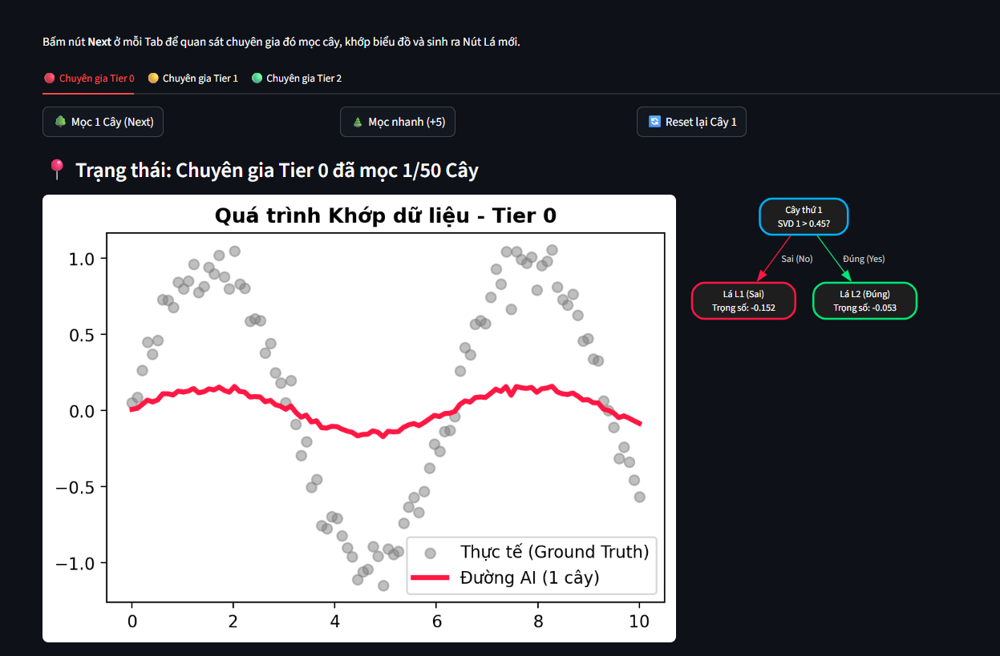
</div>

---

### 📊 Phase 1: Data Inspection
<details>
  <summary><b>▶ Nhấn để xem Slide ảnh Phase 1 (Data Analysis)</b></summary>
  <div align="center">
    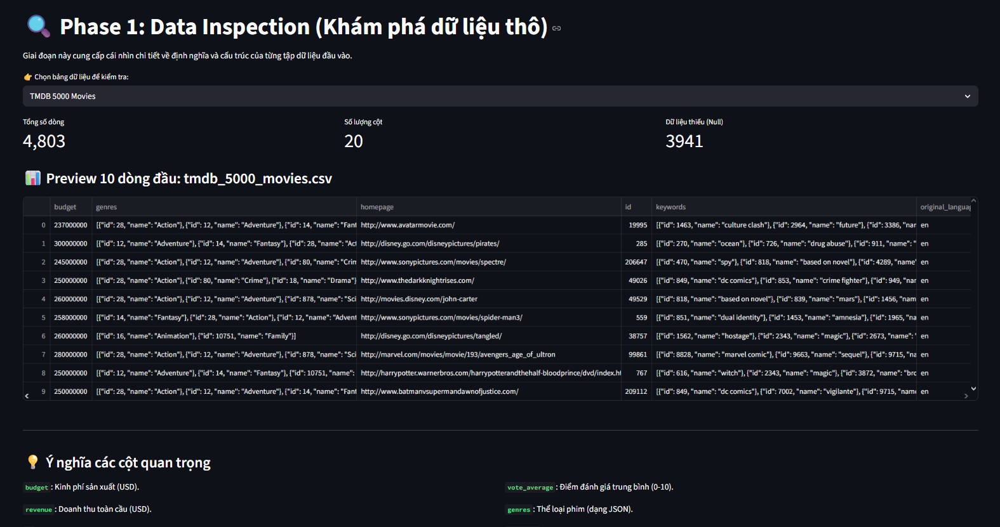
    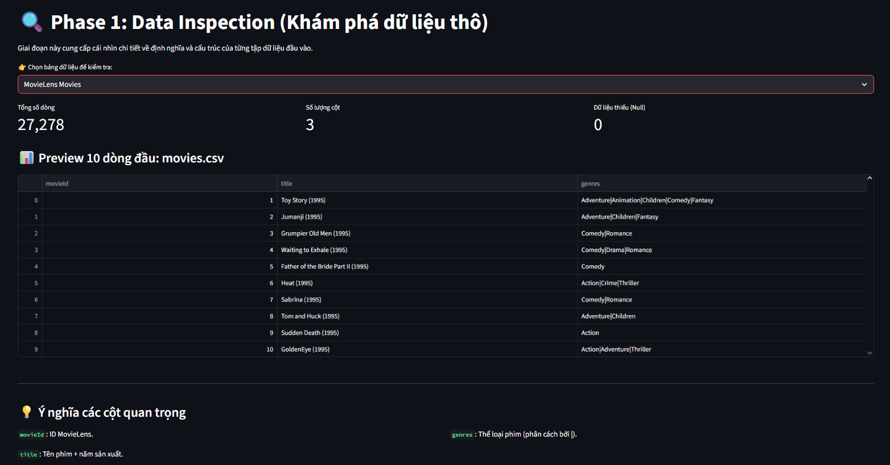
    <p><i>Phân tích dữ liệu từ TMDB & MovieLens và hiện tượng Long-tail.</i></p>
  </div>
</details>

---

### 🧠 Phase 2: Feature Engineering
Xây dựng chỉ số **Power Score** cho đội ngũ nhân sự (Actor/Director).
<div align="center">
  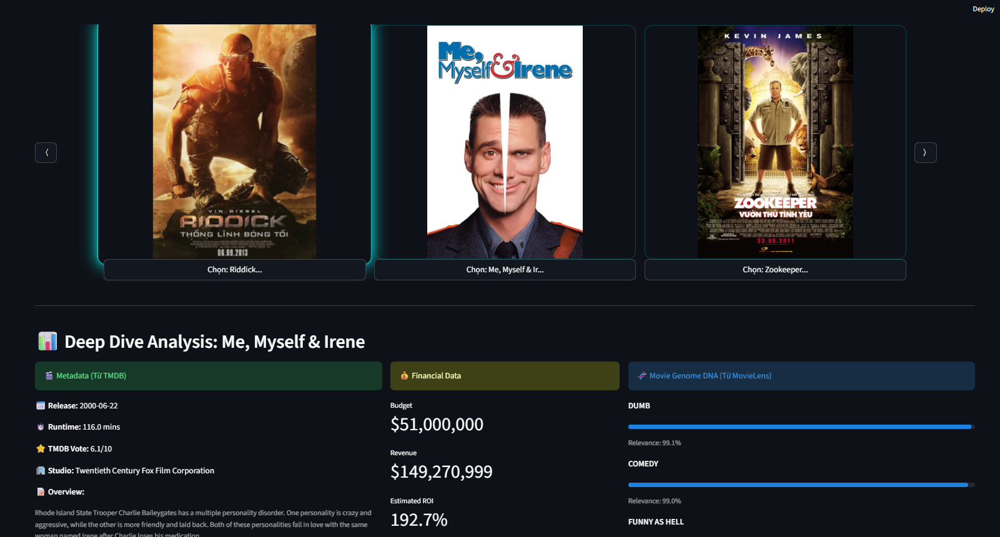
</div>

---

### 🧹 Phase 3: Feature Selection
<details>
  <summary><b>▶ Nhấn để xem Slide ảnh Phase 3 (Feature Selection)</b></summary>
  <div align="center">
    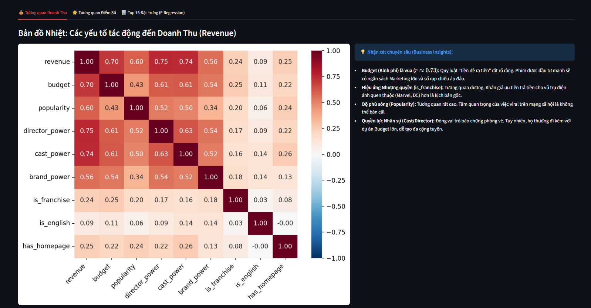
    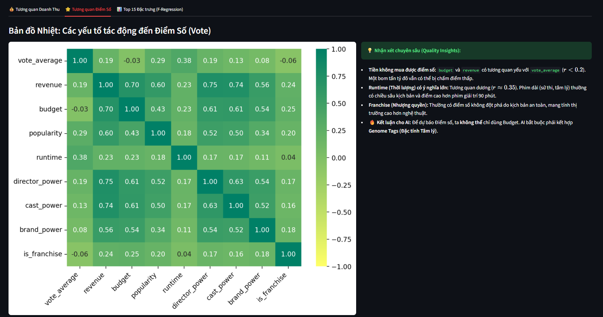
    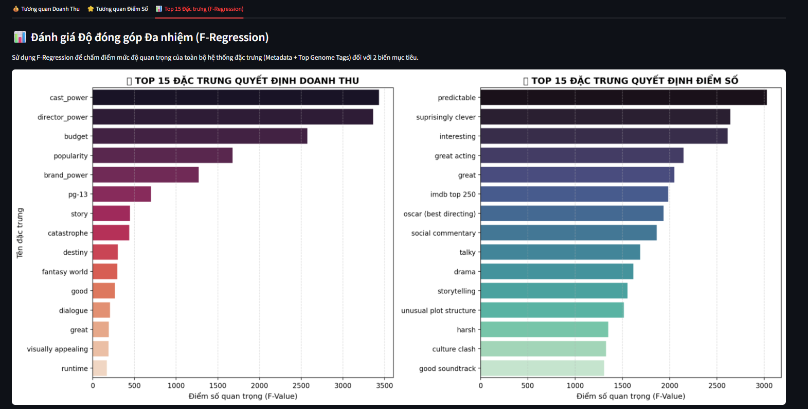
    <p><i>Sử dụng f_regression và lọc rò rỉ dữ liệu bằng Regex Blacklist.</i></p>
  </div>
</details>

---

### 🔄 Phase 4: Preprocessing
Chuẩn hóa dữ liệu về phân phối Gaussian chuẩn.
<div align="center">
  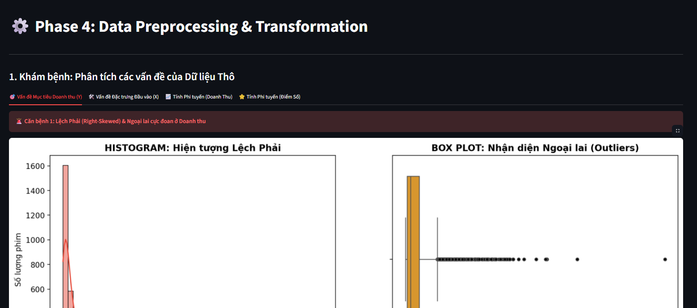
</div>

---

### 🤖 Phase 5: Hybrid Training
<details>
  <summary><b>▶ Nhấn để xem Slide ảnh Phase 5 (Training Logic)</b></summary>
  <div align="center">
    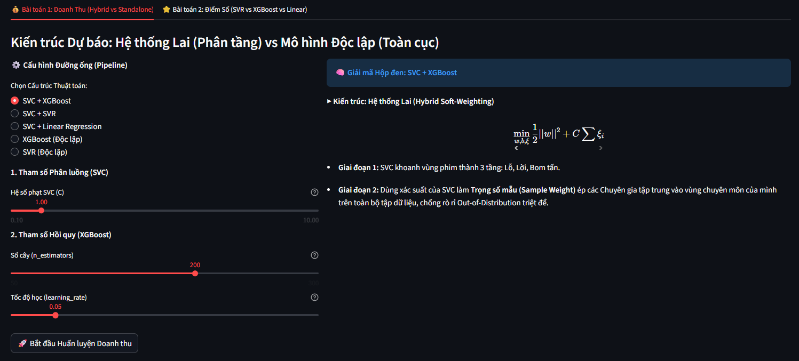
    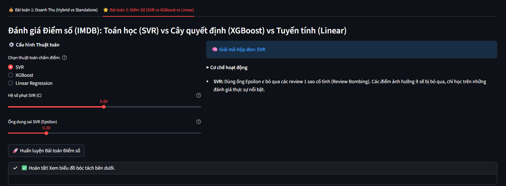
    <p><i>Kết hợp SVC Phân tầng và bộ đôi XGBoost + SVR Hồi quy.</i></p>
  </div>
</details>

---

### 🏆 Phase 6: Benchmark
<details>
  <summary><b>▶ Nhấn để xem Slide ảnh Phase 6 (Leaderboard)</b></summary>
  <div align="center">
    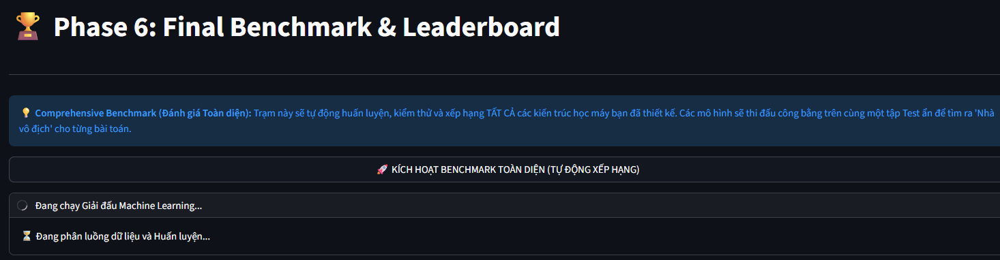
    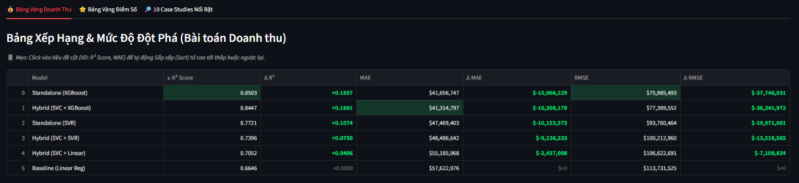
    <br>
    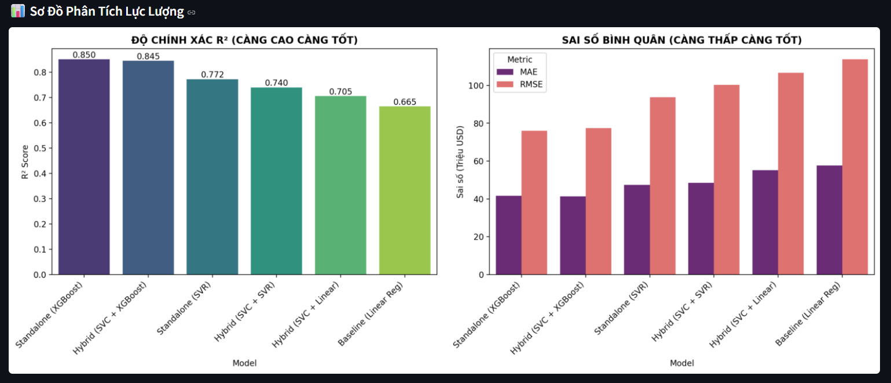
    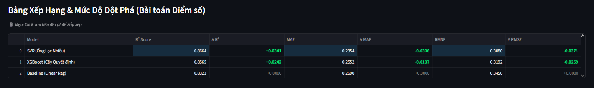
    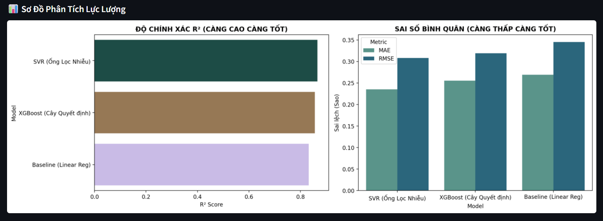
    <p><i>So sánh 9 mô hình và đo lường độ cải thiện Delta so với Baseline.</i></p>
  </div>
</details>

---

### 🚀 Phase 7: Real-time Inference Station
<details>
  <summary><b>▶ Nhấn để xem Slide ảnh Phase 7 (Kết quả dự đoán)</b></summary>
  <div align="center">
    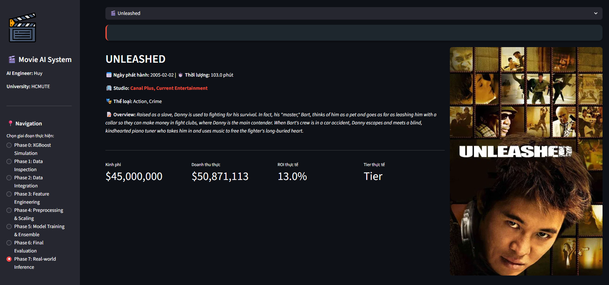
    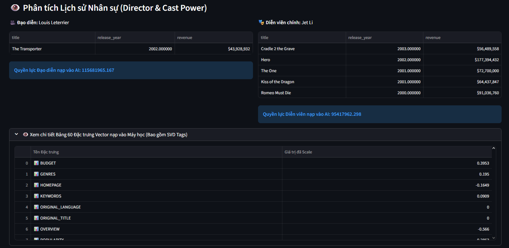
    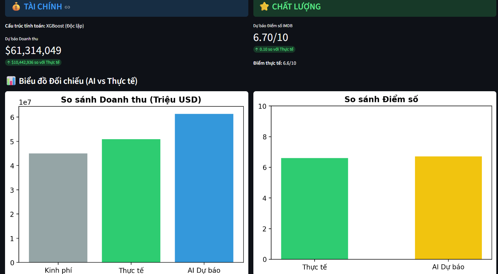
    <p><i>Dự đoán doanh thu, điểm IMDB và ROI theo thời gian thực.</i></p>
  </div>
</details>

---

## 🛠️ 3. Hướng dẫn Cài đặt & Chạy

### 1. Clone Repo
```bash
git clone [https://github.com/QuangHuyUte/Movie-Revenue-Rating-SVM-vs-XGBoost.git](https://github.com/QuangHuyUte/Movie-Revenue-Rating-SVM-vs-XGBoost.git)
cd Movie-Revenue-Rating-SVM-vs-XGBoost
```

---

### 2. Cài thư viện

```bash
pip install pandas numpy scikit-learn xgboost matplotlib seaborn streamlit beautifulsoup4 requests
```

---

### 3. Chuẩn bị dữ liệu

Tải và đặt vào thư mục gốc:

**TMDB Dataset:**
- `tmdb_5000_movies.csv`
- `tmdb_5000_credits.csv`

**MovieLens Genome:**
- `genome-tags.csv`
- `genome-scores.csv`
- `links.csv`

---

### 4. Chạy app

```bash
streamlit run app.py
```

---

## 👨‍💻 Nhóm thực hiện

- **Bùi Quang Huy**  
- **Nguyễn Tài Huy**

**GVHD:** Thầy **Bùi Mạnh Quân**  
**Đơn vị:** HCMUTE